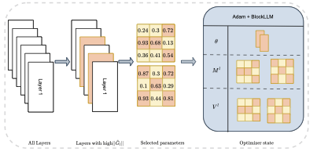

# BlockLLM
BlockLLM is a specialized optimizer designed to perform memory-efficient training of large language models (LLMs). By targeting specific coordinate blocks for optimization, BlockLLM reduces the memory footprint and accelerates training, making it ideal for scaling large models on resource-constrained hardware.

This is the official implementation of our paper https://arxiv.org/abs/2406.17296




## Installation

1. Clone the repository:
```bash
git clone https://github.com/RAmruthaVignesh/blockllm.git
cd blockllm
```

2. Install the required dependencies:
```bash
pip install -r requirements.txt
```

## Quick Start

The repository includes an example script that demonstrates how to use BlockLLM with the WikiText dataset. To run the example:

```bash
python examples/train_wikitext.py
```

This script:
1. Loads a pretrained language model from Hugging Face
2. Applies BlockLLM optimization
3. Fine-tunes the model on the WikiText dataset

## Requirements

- Python 3.7+
- PyTorch
- Transformers
- Datasets
- Bitsandbytes
- Loguru

## Usage

Here's a basic example of how to use BlockLLM with your own model:

```python
from blockllm_torch.blockllm import BlockLLM, BlockLLMConfig
from transformers import AutoModelForCausalLM

# Load your model
model = AutoModelForCausalLM.from_pretrained("your-model-name")

# Configure BlockLLM
config = BlockLLMConfig(
    block_size=8,
    sparsity_ratio=0.9
)

# Create optimizer
optimizer = BlockLLM(
    model.parameters(),
    lr=1e-4,
    config=config
)

# Train as usual
optimizer.zero_grad()
outputs = model(**inputs)
loss = outputs.loss
loss.backward()
optimizer.step()
```

## License

MIT License

## Citation

If you find our work useful, please consider citing our paper: 

```
@misc{ramesh2024blockllmmemoryefficientadaptationllms,
      title={BlockLLM: Memory-Efficient Adaptation of LLMs by Selecting and Optimizing the Right Coordinate Blocks}, 
      author={Amrutha Varshini Ramesh and Vignesh Ganapathiraman and Issam H. Laradji and Mark Schmidt},
      year={2024},
      eprint={2406.17296},
      archivePrefix={arXiv},
      primaryClass={cs.LG},
      url={https://arxiv.org/abs/2406.17296}, 
}
```